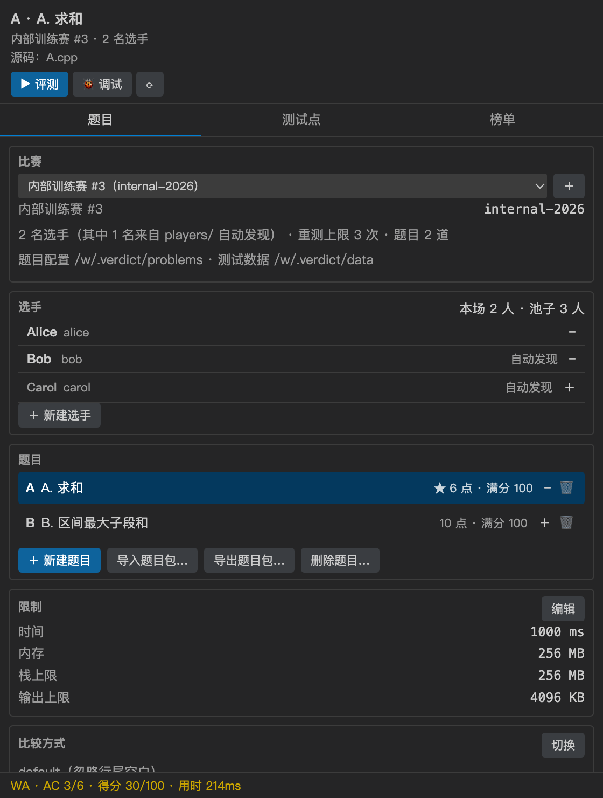
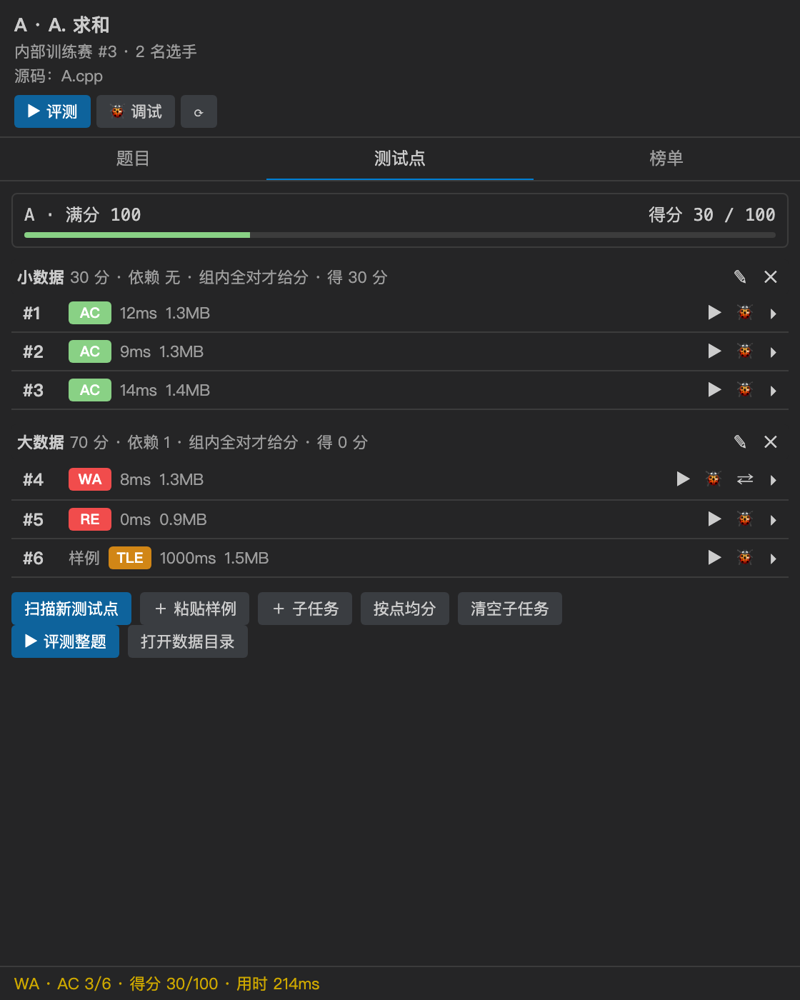
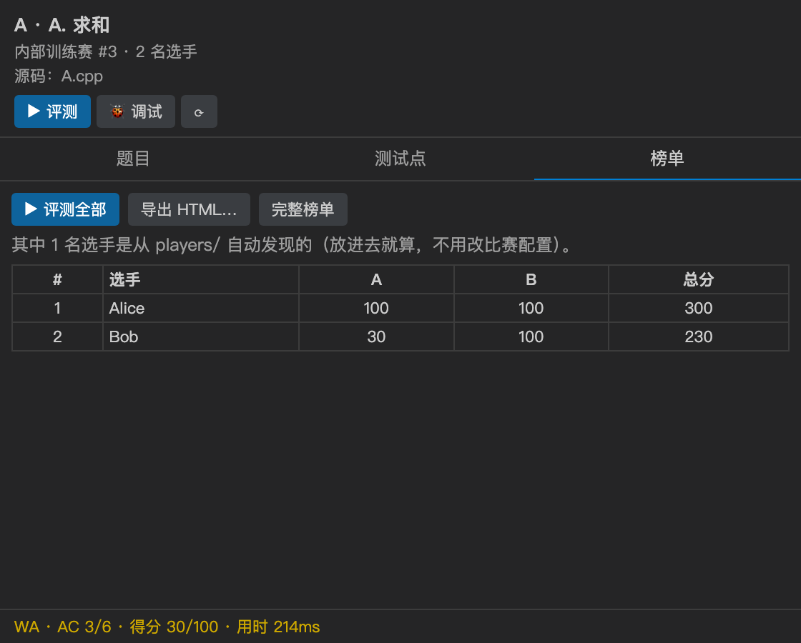
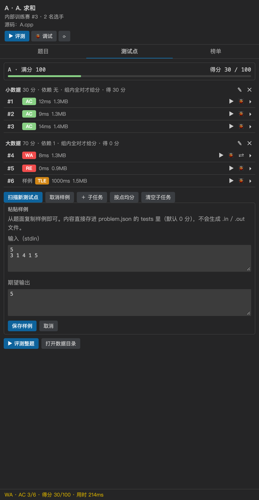
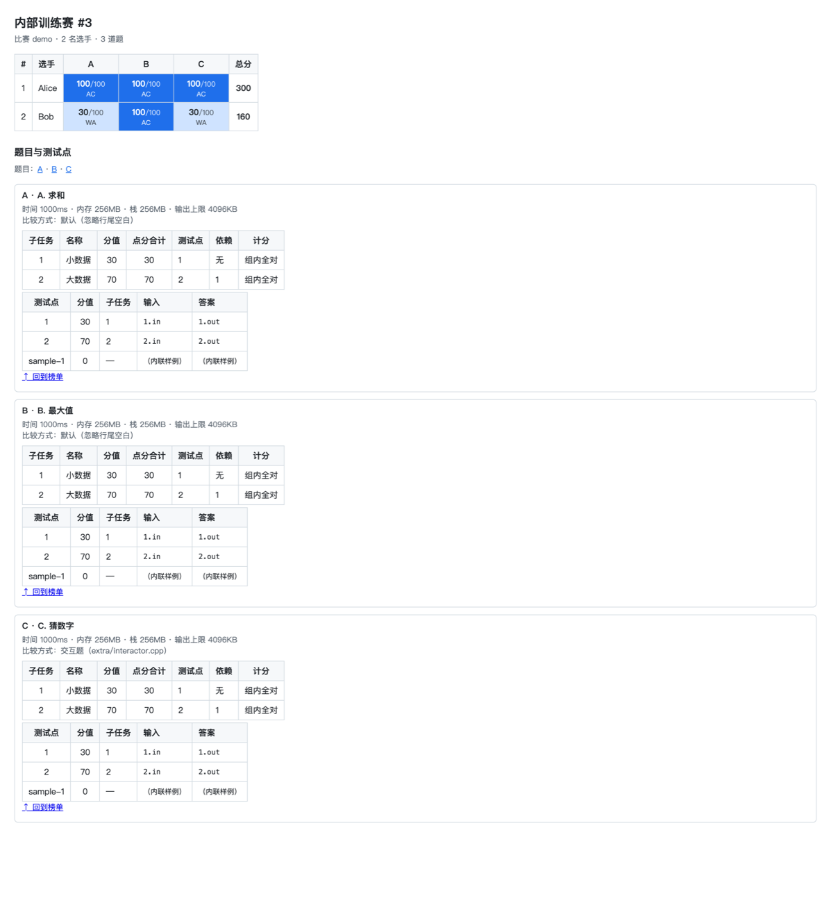
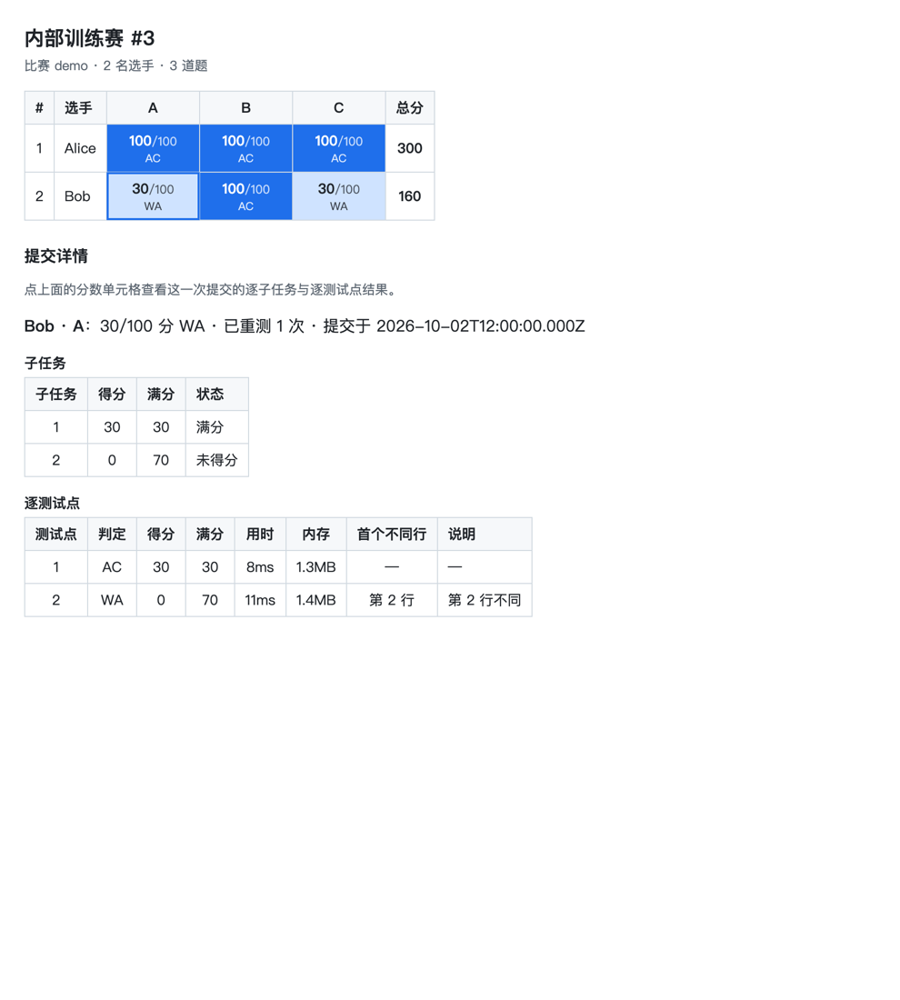

> 这篇可以直接投博客（掘金 / 知乎 / 博客园 / 个人站都行）。Markdown 是通用的，没有用任何平台专有语法。
> 配图在 `docs/blog/images/`（面板与成绩单都是用插件自己的渲染代码生成的，不是手画的 mockup），
> 投稿时上传到博客的图床、把相对路径换成图床地址即可。
> 功能对应 0.1.6（2026-10-02）。

# Verdict：把 OI/ICPC 本地评测搬进 VS Code

如果你办过小型的内部赛、或者带过学生刷题，大概熟悉这一套流程：开一个终端，
`g++ solve.cpp -o solve -O2`，然后 `./solve < 1.in`、`diff` 一下输出，
换下一组数据再来一遍；赛后有十来个人的程序要跑，成绩还得手抄进表格里。

[Verdict](https://github.com/Pt-ll/verdict-judge) 想把这些事全搬进 VS Code：
**出题、造数据、评测、调试、重测、榜单、导出成绩单**，都在编辑器里完成。
它是一个 VS Code 扩展，不是 CLI、也不是独立软件；装完在活动栏多一个图标，点开就是操作台。

它有两个我比较在意的约束：

- **完全离线**：代码里没有任何网络调用，不联网、不上报、没有账号和 API key。
- **零运行时依赖**：只用 Node 内置模块和 VS Code API，不捆绑编译器，
  编译跑的是你本机已经装好的 `g++` / `clang++` / `cl`。

## 装一个试试

| 来源 | 怎么做 |
| --- | --- |
| VS Code 官方市场 | 扩展面板搜 `Verdict`（`YuChenZhong.verdict-judge`） |
| Open VSX（VSCodium / Gitpod / Theia） | 扩展面板搜 `Verdict` |
| 手动 | 从 [Open VSX 页面](https://open-vsx.org/extension/YuChenZhong/verdict-judge) 下 VSIX，再 `code --install-extension <文件>` |

装完按 `Ctrl/Cmd+Shift+P` 跑一次 **`Verdict: 检查环境`**：它会探测编译器，
并真的编译 + 运行一个小程序自检（只探测到编译器不等于环境可用，缺链接器、权限问题都要跑一次才暴露）。

默认的编译参数是 `-O2 -std=c++17`，可以在设置里改（`verdict.flags`）。

## 六十秒上手



1. 打开一个文件夹作为工作区，活动栏点 **Verdict** 图标；
2. 面板顶部是当前题目与当前源码，下面三个页签：**题目 / 测试点 / 榜单**；
3. 打开选手源码（`.cpp` / `.py`），点顶部的 **▶ 评测**，或者「测试点」页签里某个点的 `▶`；
4. 判定进状态栏和输出通道；WA 时自动打开「实际输出 ↔ 标准答案」的原生 diff，光标停在首个不同的行；
5. 题面里的样例可以直接 **＋ 粘贴样例** 粘进来（下面细说），点 `▶` 立刻能跑；
6. 「榜单」页签点 **评测全部**，选手 × 题目整场跑完，可以 **导出 HTML…** 拿到一份断网可开的成绩单。

## 工作区长什么样

```text
你的工作区/
├── .verdict/
│   ├── players.json              # 选手池：显示名与源码目录（可选）
│   ├── contests/                 # 每场比赛一个文件，可以放好几场
│   │   └── internal-2026.json
│   ├── data/                     # 测试数据总库：一个题目一个文件夹
│   │   ├── A/                    # 1.in / 1.out / 2.in / 2.out ...
│   │   └── B/
│   ├── submissions/              # 评测记录（运行产物，不入库）
│   └── problems/
│       └── A/
│           ├── problem.json      # 题目：限制、比较方式、测试点、子任务
│           └── extra/            # checker.cpp / interactor.cpp / std.cpp
└── players/                      # 选手源码：这里的目录自动进选手池
    ├── alice/A.cpp
    └── bob/A.cpp
```

三条约定值得记住：

1. **数据集中在总库**：所有测试数据放 `.verdict/data/<题目 id>/`，用文件夹名区分题目。
   题目配置（`problem.json`）与数据分开，多场比赛共用同一道题的数据。
2. **题目库是全局的**：比赛只记题目 id 列表，所以同一道题可以同时出现在好几场比赛里，
   各场的成绩、重测次数互不影响。
3. **选手也是同一个模型**：`players/<名字>/<题目>.cpp` 放进去就进了**选手池**，
   每场比赛自己挑谁参加（面板上 `＋` / `−`）。`players.json` 里可以声明显示名与目录。

**JSON 仍然是唯一的存储格式**：面板只是 `problem.json` / `contests/*.json` 的一个视图，
每次编辑都是读-改-写，和手改文件完全等价。你喜欢 git 管数据就继续手写，面板会跟着刷新。

## 侧边栏面板

面板从上到下大概是这样：

```text
┌─ A. 求和 ──────────────────────────┐  当前题目 / 比赛 / 当前源码
│ 内部训练赛 #3 · 2 名选手            │  [▶ 评测] [🐞 调试] [■ 取消]
│ 源码：A.cpp                         │
├─────────────────────────────────────┤
│  题目  |  测试点  |  榜单            │  页签
├─────────────────────────────────────┤
│ 限制    1000ms / 256MB / 4096KB [编辑]│
│ 比较    default                 [切换] │
├─────────────────────────────────────┤
│ 小数据  30 分 · 依赖 无 · 组内全对     │
│  #1 [AC] 12ms 1.3MB      [▶][🐞][▸]  │
│  #sample-1 [AC] 5ms 1.2MB [▶][▸]     │
│ [扫描新测试点][＋粘贴样例][＋子任务]…  │
├─────────────────────────────────────┤
│ 就绪 / AC 3/6 · 得分 30/100 · 214ms   │
└─────────────────────────────────────┘
```

三个页签各管一件事：

- **题目**：切换 / 新建比赛；题目列表（`★` = 在当前比赛里，`＋` / `−` 加减，`🗑` 删题）；
  选手卡片（挑谁参加这场）；改限制与比较方式；导入导出题目包。
- **测试点**：按子任务分组，每行给最近一次判定、用时、内存；
  `▶` 单点运行、`🐞` 调试、`⇄` 看 diff、`▸` 展开看输入 / 标准答案 / 实际输出。
- **榜单**：选手 × 题目矩阵，点单元格看重测详情并重测；评测全部、导出 HTML、打开完整榜单。

三张实拍（渲染自插件自己的面板代码，数据是造出来的示例）：





## 出题流程

1. **新建比赛**：比赛下拉框旁的 `＋`，或命令 `Verdict: 新建比赛`。
   填比赛 id、标题、重测上限、参赛选手（留空也行——不写名单就是"选手池里全上"）。
2. **新建题目**：`Verdict: 新建题目`，填题目 id、时限、内存。
   数据目录 `.verdict/data/<题目 id>/` 会自动建好。
3. **放数据**：`1.in` / `1.out`、`2.in` / `2.out`……可以放很多组；
   答案后缀支持 `.out` / `.ans` / `.expected`。
4. **加测试点**：数据文件点 **扫描新测试点**（或命令 `Verdict: 导入测试点`）；
   题面里的样例点 **＋ 粘贴样例** 直接粘进来。
5. **分子任务**：OI 赛制那种"小数据 30 分、大数据 70 分，大数据依赖小数据"——
   可以 `＋ 子任务`、`按点均分`，也可以在 `problem.json` 里细调依赖与计分方式。
6. **设比较方式**：默认（忽略行尾空白）/ 逐行（报告首个不同行）/ 实数（绝对 + 相对误差）/
   testlib SPJ / 交互题（testlib interactor）。
7. **挑人**：选手源码放进 `players/<选手>/<题目>.cpp`，用选手卡片上的 `＋` / `−` 决定谁参加。
8. **办比赛**：「榜单」页签点 **评测全部**。

### 题面里的样例，直接粘进来

这是 0.1.5 新加的功能，也是我自己出题时最省事的一条：题面里通常给了两三组样例，
以前得手动建成 `sample1.in` / `sample1.out`（然后这些文件会混在真正的测试数据里）。

现在点「**＋ 粘贴样例**」，左边粘输入、右边粘期望输出，保存即可：



它有三个特点：

- **不生成任何数据文件**：内容直接写进 `problem.json` 的 `tests` 里
  （`"inputText"` / `"answerText"`），所以样例跟着题目一起保存、导出、进 git；
- **默认 0 分**：样例是用来"跑一下看对不对"的，不该把整题满分撑大。想让它算分，
  事后在 `problem.json` 里写个 `points` 就行；
- **和普通测试点一样能跑**：点 `▶` 出判定，WA 时照常开 diff、标首个不同行，也能 `🐞` 调试
  （调试器只认文件路径，插件会把内联内容落到缓存目录当 stdin 文件，不污染你的工作区）。

一个题目的 `problem.json` 里可以同时有数据文件与内联样例：

```jsonc
{
  "id": "A",
  "name": "A. 求和",
  "limits": { "timeMs": 1000, "memoryMb": 256, "stackMb": 256, "outputKb": 4096 },
  "comparator": { "mode": "default" },
  "subtasks": [
    { "id": "1", "name": "小数据", "points": 30, "tests": ["1"], "dependsOn": [], "scoring": "min" },
    { "id": "2", "name": "大数据", "points": 70, "tests": ["2"], "dependsOn": ["1"], "scoring": "min" }
  ],
  "tests": [
    { "id": "1", "input": "1.in", "answer": "1.out", "points": 30, "subtask": "1" },
    { "id": "2", "input": "2.in", "answer": "2.out", "points": 70, "subtask": "2" },
    // 内联样例：没有对应的数据文件
    { "id": "sample-1", "inputText": "1 2\n", "answerText": "3\n", "points": 0 }
  ]
}
```

测试点路径相对**数据目录**（也就是 `.verdict/data/A/` 里的 `1.in`）。同一侧
「文件名」与「内联内容」只能二选一，两个都写（或都不写）会在加载时报错——
与其猜以哪个为准，不如当场说清楚。

### 不想要的数据，删掉

测试点展开后有两个删除入口：

- **删除样例**：只从 `problem.json` 里去掉那段文本；
- **删除数据文件**：把 `.in` / `.out` 送进系统回收站，并同时取消登记
  （点一下会变成「确认删除 / 取消」，删错了能从回收站捞回来）。

只想让它暂时不算数、文件先留着，就用「移出登记」。

## 评测、判定与调试

判定和大多数 OJ 一致：`AC` 通过、`WA` 答案不对、`TLE` 超时、`MLE` 超内存、`OLE` 输出超限、
`RE` 运行时错误、`CE` 编译失败（诊断进问题面板，可点击跳到行列）、
`PC` 表现错误（SPJ 的 PE）、`UKE` 无法判定（例如 checker 编译失败——如实上报，不假装判过）。

评测有几条入口，哪边顺手用哪边：源码顶部的 CodeLens（`▶ 评测` / `🐞 调试首测点` / `⚙ 限制`）、
面板顶部的 `▶ 评测` 或测试点行上的 `▶`、命令 `Verdict: 评测当前文件`。

两个细节做得比较克制：

- **只跑一个测试点时，面板不显示总分**：子任务计分是拿整套数据算的，
  单跑一个点得到的分数是**下界**，把它当结论展示是在骗人。要完整分数就点「评测整题」。
- **WA 自动开 diff**：一次评测几十个点全打开会铺满编辑器，所以只开第一个失败的点，
  并跳到首个不同的行。

调试用你已装的调试扩展（C++ 是 `ms-vscode.cpptools`，Python 是 `ms-python.debugpy`）。
便利之处在于**测试点输入会自动接到 stdin**，不需要你自己去翻 `1.in` 再手动喂进去。

交互题（testlib interactor）也支持调试：真实跑一局把交互器发过来的提示串录下来，
调试时用这串输入当 stdin 回放，于是断点、单步都能用。

## 比赛：选手、重测、榜单、成绩单

- **多场比赛**：`.verdict/contests/<id>.json` 一场一个文件，面板上切换。当前用哪一场会记住。
- **题目与选手都可以重叠**：题目库和选手池是工作区级的，比赛只记"这场用哪些题、谁参加"，
  所以同一道题、同一个人可以同时出现在多场比赛里。
- **评测全部**：选手 × 题目逐个跑，每跑完一条就落盘，中途取消不丢已完成的。
  找不到源码的格子会列出"跳过（没有源码）"。
- **重测**：每个格子有重测次数上限（`maxRejudge`），到顶后拒绝并说明原因；
  「评测全部」是整场重跑，不受这个上限约束。
- **榜单**：OI 赛制取每格最高分（同分取更早的那次），并列名次跳号（1、2、2、4）。

### 导出的成绩单

「导出 HTML…」生成的是一份**自包含**的成绩单：内联 CSS 与数据，没有任何外部资源，
断网双击就能看，适合直接发给别人或归档。它有两部分，而且**可以点着看**：



- 榜单表头（A / B / C）可以点，跳到下面「题目与测试点」里对应那一节；
  每节末尾有「↑ 回到榜单」；
- 点分数格子会滚到并展开这一次提交的详情：子任务得分、逐测试点的判定 / 得分 / 用时 /
  内存 / 首个不同行，点过的那一格会高亮。

点 Bob 的 A 题那一格（30 分、WA、已重测 1 次），页面下方会长出这样两张表——
连"第 2 行不同"都写在里面：



题目与测试点清单本身（限制、比较方式、子任务、每个点用哪份数据、内联样例）
不依赖提交记录，所以就算某个人没交，这份成绩单也是完整的题目说明。

## 题目包的迁移

- **导出题目包**：生成一个 ZIP，里面有 `problem.json`、`extra/`（checker / std / testlib.h）
  和全部测试数据——数据存在总库里也会被打进包内的 `data/`。
  同一个题目包每次导出的字节完全一致，便于比对与入库。
- **导入题目包**：解到 `.verdict/problems/<题目 id>/`，包里的数据自动搬进总库，
  并顺手加进当前比赛。目标目录已存在时会拒绝覆盖（不会静默盖掉别人正在改的数据）。

## 命令与设置

面板能做的事都有对应命令，习惯键盘的话直接用命令面板：

| 命令 | 说明 |
| --- | --- |
| `Verdict: 检查环境` | 探测编译器并做一次编译 + 运行自检 |
| `Verdict: 评测当前文件` / `取消当前任务` | 评测 / 中止 |
| `Verdict: 调试首测点` / `对比输出` | 起调试会话 / 打开 diff |
| `Verdict: 导入测试点` / `配置子任务` / `设置限制` | 出题三件套 |
| `Verdict: 新建比赛` / `切换比赛` | 多场比赛 |
| `Verdict: 新建题目` / `删除题目` | 建题 / 删题（可选保留还是连数据一起删） |
| `Verdict: 新建选手` | 建好 `players/<名字>/` 并加进当前比赛 |
| `Verdict: 让选手参加 / 退出当前比赛` | 每场比赛的名单 |
| `Verdict: 把题目加入 / 移出当前比赛` | 题目库共用，题目可重叠 |
| `Verdict: 评测全部` / `重测` / `显示榜单` / `导出 HTML 成绩` | 办比赛 |
| `Verdict: 导出题目包` / `导入题目包` | 题目包迁移 |

设置项（都在 `verdict.*` 下）：

| 设置 | 默认 | 说明 |
| --- | --- | --- |
| `verdict.compiler` | 空 | 编译器完整路径；留空自动探测 `g++` → `clang++` → `cl` |
| `verdict.flags` | `-O2 -std=c++17` | 编译参数 |
| `verdict.defaultTimeMs` / `defaultMemoryMb` / `outputLimitKb` | 1000 / 256 / 4096 | 默认限制（题目里写了以题目为准） |
| `verdict.comparator` | `default` | 没有题目包时的比较方式 |
| `verdict.testlibPath` | 空 | `testlib.h` 所在目录或文件 |
| `verdict.autoDiff` | `true` | WA / PC 时自动打开 diff |
| `verdict.debugStopAtEntry` | `false` | 调试时先停在程序入口 |

`testlib.h` **不随插件提供**（插件零依赖、不联网）。查找顺序是：题目包 `extra/` →
工作区 `.verdict/testlib/` → 设置 `verdict.testlibPath`。都没找到时会给可操作提示。

## 几个设计取舍

写的过程中做过几个不太显眼但影响使用手感的决定，记在这里：

- **为什么坚持零依赖**：评测要在别人的机器上跑，装插件不该顺带把 Node 生态拉进来。
  现在安装包里只有 9 个文件（代码、图标、README、CHANGELOG、LICENSE），没有 `node_modules`。
- **为什么数据放总库、样例放 JSON**：两者解决的问题不同。真实的测试数据往往几十上百组、
  可能几十 MB，放文件夹最省心（也方便脚本批量生成）；而题面样例只有两三组、
  是"题目说明"的一部分，直接存在 `problem.json` 里才能跟着题目走——复制题目、
  导包、`git clone` 都自动带上。
- **为什么去掉 Testing 面板**（0.1.4）：VS Code 会给注册了测试控制器的扩展在活动栏放个烧瓶图标，
  但我们已经有侧边栏面板了，两个入口只会让人不知道该点哪个。现在评测与调试只有
  面板 / CodeLens / 命令三条入口。
- **为什么比较器全程按字节比较**：先 `toString('utf8')` 再比会把不同的非法字节统一成
  `U+FFFD`，于是一份本该判 WA 的输出可能被判成 AC。这条有单测盯着。

## 已知限制

不想让人按想象使用，所以直说：

- **Linux 上的调试输入注入未验证**：macOS（lldb）已用集成测试证明可用；
  gdb 走 `set inferior-tty`，真没生效时会退化成手动喂输入。
- **MSVC 的调试器没有注入能力**，调试时只能手动输入（提示里会给出输入文件路径）。
- **Python 调试只有配置层面的单测**，没有真机验证。
- **成绩单里不放实际输出正文**：评测记录只存判定、分数、耗时、内存，
  输出上限按 KB 算，塞进 HTML 会让文件大到没法发。要看输出用 diff 或重跑一次。
- **并行评测与"保存即评测"还没实现**，整场比赛是逐个提交顺序跑的。
- **交互题调试是录制-重放**：程序这次的反应若与录制时不同（自适应交互器），后面会对不上。
- 提交答案题（output-only）与通信题是后续计划，本版没有。

## 最后

- 仓库：<https://github.com/Pt-ll/verdict-judge>
- 使用说明（持续更新的版本）：<https://github.com/Pt-ll/verdict-judge/wiki/插件使用说明>
- 更新日志：<https://github.com/Pt-ll/verdict-judge/blob/main/CHANGELOG.md>

MIT 许可。项目自带三平台 CI（Windows / macOS / Linux）：每次提交都会真的编译并运行样例程序，
覆盖 AC / WA / TLE / RE / OLE / CE 六种判定与 diff 行号定位，而不是只跑 mock。
用起来有问题、或者你想要哪种题型支持，欢迎开 issue。
